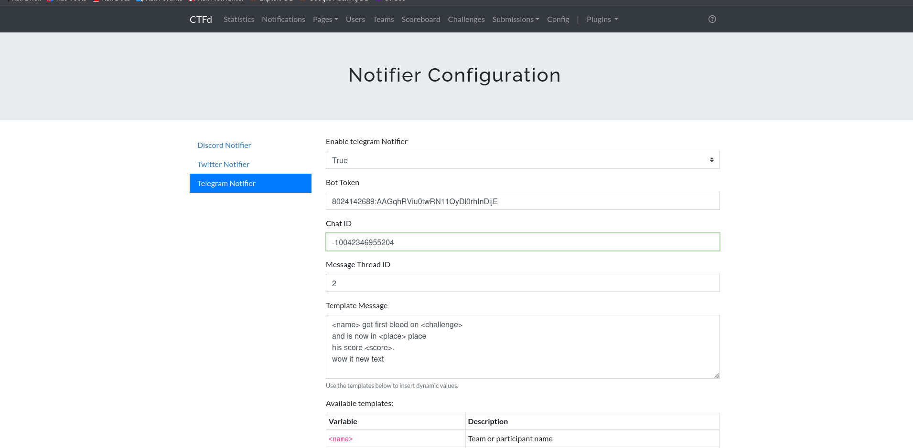
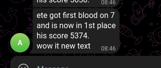
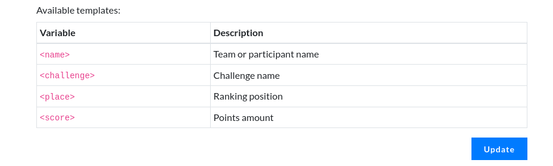

Вот обновленный текст с добавленной информацией:

# CTFd Notifier
This is a Plugin for the popular CTF Platform [CTFd](https://github.com/CTFd/CTFd). It's purpose is to share when a User or Team gains firstblood on a challenge. The supported platforms are Discord via Webhooks and Twitter via the Twitter API.

The Plugin is fully configurable in the backend! If you have any feature requests leave an issue :)

# Requirements
CTFd >= 3.0.0

## Installation
If you don't have CTFd installed, use:
```bash
git clone https://github.com/ctfd/ctfd.git
```

If you already have CTFd installed, navigate to the plugins directory and clone this repository:
```bash
cd /ctfd/plugins
git clone https://github.com/d1temnd/ctfd-notifier
```

## Telegram Configuration
To set up Telegram notifications:
1. Specify your Telegram bot token
2. Provide the chat ID where notifications should be sent
3. Optionally specify the topic ID for First Blood notifications
4. Customize the notification message using templates available on the settings page

## Screenshots




